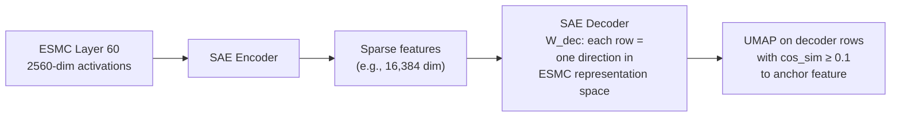
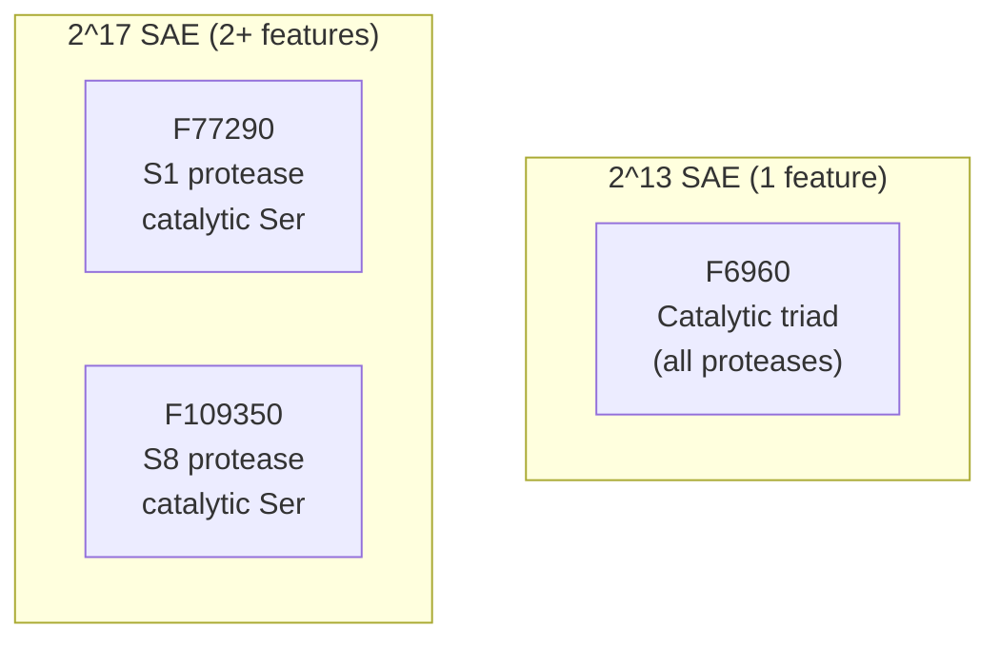

<alphaxiv-thinking-title title="Designing Panel D interactivity" />

Let me dig into the paper's details on Panel D to give you a precise plan.

From the paper, Figure 4D is a **UMAP projection of decoder-weight directions** — each dot is an SAE *feature* (not a protein), and the plot shows all features whose decoder vector has cosine similarity ≥ 0.1 to the anchor feature F6716 (the nucleophilic elbow). Multiple SAE dimensionalities (2¹³, 2¹⁴, 2¹⁶) are overlaid as different-sized markers to show feature splitting.

---

## What Panel D Actually Represents

This is critical for the design: the scatter plot is **not** showing proteins. It's showing **features** — directions in ESMC's 2560-dim representation space, each with an agent-generated biological description. The spatial layout reflects semantic similarity: features with similar decoder vectors (meaning they correspond to related biological concepts) cluster together in the UMAP.



---

## Interactive Implementation Plan

### Cell 1 — The Core Scatter Plot

The main visualization is a 2D UMAP scatter of ~30–300 features (those with cosine similarity ≥ 0.1 to the anchor). Here's the faithful interactive version:

```python
anchor_feature = mo.ui.dropdown(
    options=all_feature_ids, 
    value="F6716",  # default: nucleophilic elbow
    label="Anchor feature"
)

# Reactive: filter decoder directions
neighbors = decoder_weights[cos_sim(decoder_weights, anchor_weights) >= 0.1]
neighbor_df = pd.DataFrame({
    "umap_x": umap_coords[:, 0],
    "umap_y": umap_coords[:, 1],
    "feature_id": ids,
    "category": categories,
    "description": summaries,
    "sae_dim": sae_dimensionalities,  # 2^13, 2^14, 2^15, 2^16, 2^17
    "cos_sim_to_anchor": cos_sim_values,
    "is_anchor": ids == anchor_feature_id,
})

fig = px.scatter(
    neighbor_df,
    x="umap_x", y="umap_y",
    color="category",
    size="sae_dim",  # larger markers for smaller SAE dims
    hover_data=["feature_id", "description", "cos_sim_to_anchor"],
)
```

**Faithfulness to the original graphic**:
- The original uses **dot size** to encode SAE dimensionality: smaller dimensionalities (2¹³) have fewer, larger dots (each dot is a coarser concept); larger dimensionalities (2¹⁶) have more, smaller dots (feature splitting).
- Color encodes feature **category** (from Figure 4B's classification: residue identity, secondary structure, tertiary interactions, disorder, functional sites, etc.)
- The anchor feature (F6716) is highlighted (the paper's figure uses a distinct marker style)
- **Axes are unlabeled** in the original UMAP — this should be preserved (UMAP axes aren't meaningful)

### Cell 2 — Dimensionality Overlay Controls

```python
sae_dims_to_show = mo.ui.checkbox_group(
    options=["2^13", "2^14", "2^15", "2^16", "2^17"],
    value=["2^13", "2^14", "2^16"],  # match Figure 4D
    label="SAE dimensions to overlay"
)
```

When toggled, features from only the selected dimensionalities are shown. This lets the user see:
- At **2¹³**: ~1 feature for the nucleophilic elbow concept (coarse)
- At **2¹⁶**: ~10 features splitting that concept across contexts (fine-grained)
- The **overlap** between dimensionalities — same UMAP space since all SAEs reconstruct the same ESMC representations

### Cell 3 — Feature Detail on Click (The "3D Model" Question)

This is where the 3D protein models come in. **Each dot is a feature**, and each feature activates on specific residues in specific proteins. When a user clicks a dot:

**What to render**: A side panel with three elements:

**A) Feature identity card**
```
Feature ID: F6716 | Category: Functional sites
Description: "Nucleophilic elbow catalytic motif — sharp turn 
  positioning a Ser/Cys nucleophile for carbonyl attack. 
  Activates on the nucleophile residue in serine/cysteine 
  proteases and hydrolases..."
Exemplars: trypsin (1a0j), subtilisin (1scj), 
  TEV protease (1lvm), esterase (1auo), ...
```

**B) Per-residue activation strip** — a horizontal heatmap for each of 4–5 representative proteins, showing activation intensity (yellow→orange→red) along the sequence, with secondary structure annotations below:

```
Protein 1: 1a0j (trypsin)
  ████████████░░░░░░███████████████░░░░██████████
  ^^^^^^^^    ^^^^^^^^^^^^^^^^^^    ^^^^^^^^
  beta-sheet     helix          beta-sheet
                    ★ ← nucleophile (Ser195)

Protein 2: 1scj (subtilisin)
  ██████████████████░░░░░░████████████████████
```

**C) Reactive 3D structure** — Yes, this should absolutely be included, and it's the most impactful interactive element.

```python
# py3Dmol viewer, reactive on feature click
view = py3Dmol.view(query=f"pdb:{representative_pdb_id}")
view.addStyle({"cartoon": {"color": "white"}})
# Color residues by feature activation
for residue, activation in feature_activations.items():
    color = activation_to_color(activation)  # white→orange scale
    view.addStyle(
        {"chain": "A", "resi": residue},
        {"cartoon": {"color": color}}
    )
# Highlight nucleophile with spheres
view.addStyle(
    {"chain": "A", "resi": nucleophile_pos},
    {"stick": {"radius": 0.3, "color": "red"}}
)
```

**Multiple structures**: Since the whole point of F6716 is that it activates across **diverse folds** (25 distinct folds), the reactive viewer should let the user cycle through representative proteins from different folds — trypsin (beta), subtilisin (alpha/beta), TEV protease (beta-sandwich), etc. Use a carousel or dropdown:

```python
structure_selector = mo.ui.dropdown(
    options=[
        ("1a0j", "Trypsin (beta)"), 
        ("1scj", "Subtilisin (alpha/beta)"),
        ("1lvm", "TEV protease (beta-sandwich)"),
        ...
    ],
    value="1a0j",
    label="Representative structure"
)
```

This directly illustrates the paper's key claim: F6716 activates on 75/99 enzymes across 25 folds.

### Cell 4 — Feature Splitting Visualization

This is a unique interactive element that goes beyond the static figure. Show a **parallel coordinates** or **side-by-side treemap** view of how concepts split across SAE dimensionalities:



For the nucleophilic elbow specifically, show one table row per dimensionality, with the number of features covering that concept and their specificity patterns:

| SAE Dim | Features for nucleophilic elbow | Specificity |
|---|---|---|
| 2¹³ | 1 (F6960) | All families |
| 2¹⁴ | 2 | General + family-specific |
| 2¹⁵ | 4 | Broad + intermediate + specific |
| 2¹⁶ | 10 | Highly context-specific |

User can click any feature → Cell 3 activates showing that feature's protein structures.

### Cell 5 — Neighborhood Semantic Labels

The static figure doesn't label clusters, but an interactive version should enable on-demand labeling. Implement a **cluster labeling** feature:

- Use HDBSCAN or DBSCAN on the UMAP coordinates to identify local clusters
- Show the most common category or description words as labels
- User can toggle labels on/off with a checkbox

For the F6716 neighborhood, the paper says it contains "other flexible catalytic loops and phosphorylation motifs" — these cluster labels would emerge naturally.

---

## Full Layout (marimo Dashboard)

```
┌─────────────────────────────────────────────────────┐
│  [Anchor feature dropdown]  [SAE dim checkboxes]     │
├──────────────────────────┬──────────────────────────┤
│                          │  Feature: F6716           │
│   UMAP Scatter Plot      │  ─────────────────────    │
│   (Panel D main view)    │  Category: Functional site │
│                          │  Description: ...         │
│   • F6716 ★ (anchor)     │                           │
│   • Other features ●     │  [Tab: Structures]         │
│   • Size = SAE dim       │  [Structure dropdown]     │
│   • Color = category     │  ┌──────────────────┐     │
│                          │  │  3D protein       │     │
│                          │  │  (py3Dmol)        │     │
│                          │  │  colored by       │     │
│                          │  │  activation       │     │
│                          │  └──────────────────┘     │
│                          │  Activation strip:        │
│                          │  ████░░██████░░████       │
├──────────────────────────┴──────────────────────────┤
│  Feature Splitting Table (per SAE dim)               │
│  2^13: 1 feature | 2^14: 2 | 2^15: 4 | 2^16: 10    │
└─────────────────────────────────────────────────────┘
```

---

## Data Needed

You'd need:

1. **Decoder weight matrices** from SAEs at each dimensionality (2¹³–2¹⁷) trained on ESMC 6B layer 60 — each is a `[n_features, 2560]` float matrix
2. **Precomputed UMAP** embedding of the combined neighbor set (features with cos_sim ≥ 0.1 to any anchor of interest) — should include features from all dimensionalities so they land in the same space
3. **Per-feature metadata**: agent-generated description, category label, exemplar protein IDs
4. **Per-feature residue-level activations** on exemplar proteins (protein_id → array of per-residue activation values)
5. **PDB structures** for exemplar proteins (or ESMFold2-predicted structures formatted as PDB)

All of these are producible from the paper's open-source code at [github.com/Biohub/esm](https://github.com/Biohub/esm) — the SAEs are released as part of the model weights.
